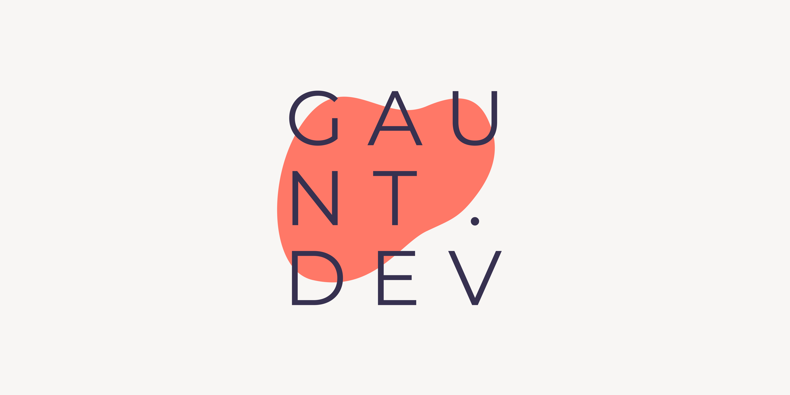

## Dependencies

```
go install github.com/gauntface/go-html-asset-manager/v5/cmds/htmlassets@latest
go install github.com/gauntface/go-html-asset-manager/v5/cmds/genimgs@latest
go install github.com/tdewolff/minify/v2/cmd/minify@latest
npm install -g avif
```

## Themes

`gaunt.dev` is the live theme. `gaunt-site` is the redesign and `styleguide`
is for building its components. `config/development/config.json` switches to
the new themes, so `npm run dev` previews them and production builds are
unchanged.
